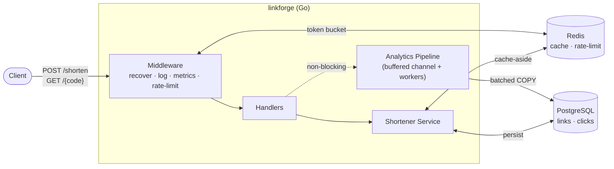
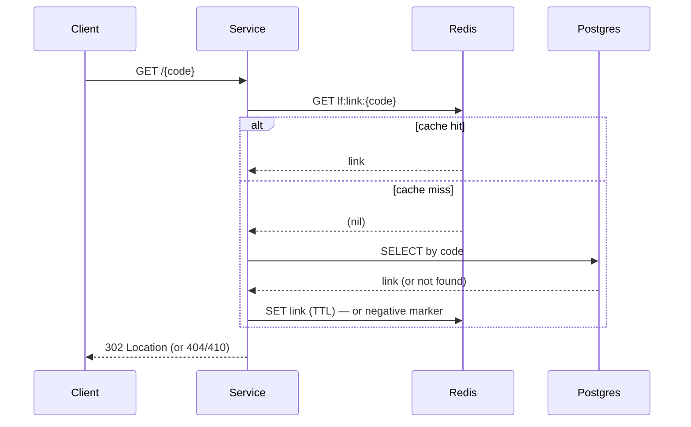
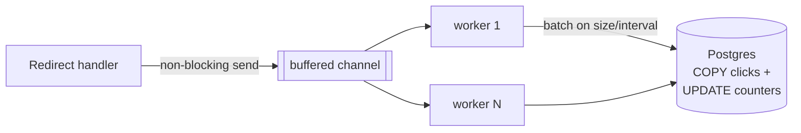

# linkforge

[](https://github.com/shaurya703/linkforge/actions/workflows/ci.yml)
[](LICENSE)

A production-minded URL shortener in Go, built to demonstrate **backend systems
engineering** — caching, rate limiting, async processing, and observability —
rather than UI. The emphasis is correctness, low-latency reads, and operational
maturity.

On a single instance against local Postgres + Redis, the redirect hot path sustains
**~26,500 req/s at p99 ≈ 5.4 ms with a 99.99% cache hit rate and zero errors**
([benchmark below](#benchmark-results)).

---

## Contents
- [Features](#features)
- [Architecture](#architecture)
- [Design decisions & tradeoffs](#design-decisions--tradeoffs)
  - [Short code generation](#short-code-generation)
  - [Caching the redirect hot path](#caching-the-redirect-hot-path)
  - [Rate limiting](#rate-limiting)
  - [Async click analytics](#async-click-analytics)
- [API](#api)
- [Running it](#running-it)
- [Testing](#testing)
- [Load testing & benchmark](#load-testing--benchmark)
- [What I'd improve / how I'd scale this](#what-id-improve--how-id-scale-this)

## Features

- `POST /shorten` — validate + normalize a URL, return a short code; identical
  non-expiring URLs **dedupe** to one code.
- `GET /{code}` — fast 302 redirect (the hot path), served from Redis.
- **Custom aliases** with collision handling (`409` on conflict).
- **Expiring links** via optional TTL (`410 Gone` after expiry).
- **Click analytics** (count + referrer/user-agent/IP/timestamp) recorded
  **asynchronously**, never blocking the redirect.
- **Redis-backed rate limiting** on the write path.
- **Observability**: structured JSON logs, Prometheus `/metrics`, `/healthz` +
  `/readyz`, graceful shutdown, connection pooling, timeouts.

## Architecture

Clean layered architecture with dependency injection — handlers depend on
interfaces (`Service`, `LinkStore`, `Cache`, `RateLimiter`, `Enqueuer`), and the
concrete implementations are wired only in `main.go`. This keeps the core logic
free of infrastructure and trivially testable.



**Package layout**

```
cmd/server            composition root: config, wiring, graceful shutdown
internal/
  config              env-based configuration
  domain              core types + sentinel errors (no infra deps)
  shortener           service + base62 code gen + URL normalization
  cache               Redis cache-aside (redirect hot path)
  ratelimit           Redis token-bucket limiter (atomic Lua)
  analytics           async click pipeline (channel + worker pool)
  repository          pgx repositories (links, clicks)
  observability       slog logger + Prometheus metrics
  transport/http      router, middleware, handlers, JSON errors
  integration         end-to-end tests (testcontainers)
migrations            embedded SQL migrations (golang-migrate)
loadtest              k6 script
```

## Design decisions & tradeoffs

### Short code generation

**Approach: base62-encode a Postgres sequence value.**

Each link gets the next value from a database sequence; the short code is that
integer in base62 (`0-9a-zA-Z`). The properties:

- **Collision-free by construction** — distinct ids → distinct codes. No retry
  loop, no probabilistic failure under load.
- **O(1) and short** — `base62(1,000,000,000)` is 6 characters.

Compared to the alternatives:

| Approach | Collisions | Notes |
|---|---|---|
| **base62(sequence)** ✅ | none, by construction | codes are sequential → enumerable |
| Random base62 + uniqueness check | rare, but must retry | retry rate climbs as keyspace fills |
| Hash(URL) truncated | must handle collisions | breaks one-URL-many-codes (TTL/custom) |

**Tradeoff & mitigation:** sequential codes are guessable/enumerable. The fix
without losing the collision-free property is to apply a **reversible permutation**
(e.g. a Feistel network or multiply-by-coprime-mod-N) over the id space before
encoding — codes look random, but each still maps 1:1 to an id. Left as a
documented `Generator` swap since the threat model here doesn't require it.

### Caching the redirect hot path

`GET /{code}` is the latency-critical path, so it uses a **cache-aside** pattern
over Redis:



- **Population:** on a miss we read Postgres and `SET` the link with a TTL. The
  cache TTL is capped so an entry never outlives the link's own expiry.
- **Negative caching:** misses for non-existent codes are cached briefly (a
  sentinel value) to absorb floods of bad lookups — cache-penetration defense.
- **Invalidation:** entries are deleted on expiry detection (and would be on
  update/delete). Because codes are immutable once created, the only invalidation
  in the MVP is expiry; the hook is in place for mutations.
- **Resilience:** every cache operation is best-effort — a Redis error degrades to
  a Postgres read, never an error to the client.

The measured hit rate at steady state was **99.99%** (see benchmark).

### Rate limiting

**Algorithm: token bucket, in Redis, via an atomic Lua script**, keyed per client IP.

- **Why token bucket:** it bounds the *sustained* rate (the refill rate) while
  permitting short *bursts* up to the bucket capacity. A fixed window would either
  reject legitimate bursts or allow a 2× spike across a window boundary; a
  sliding-window log is accurate but stores per-request timestamps.
- **Why Lua:** the refill-then-take is a read-modify-write that must be **atomic**
  across many app replicas sharing one Redis. Running it server-side in a single
  round trip removes the race entirely.
- **Fail-open:** if Redis is unreachable the limiter allows the request (logged) —
  a limiter outage must not take down the write endpoint.

On a `429` the response includes a `Retry-After` header.

### Async click analytics

The redirect must not wait on an analytics write. The handler does a
**non-blocking** hand-off to a buffered channel; a pool of workers batches events
and flushes them to Postgres.



- **Batching:** workers accumulate events and flush on **batch size** or a
  **flush interval**, whichever comes first — detail rows go in via Postgres
  `COPY`, and per-code counters update in one pipelined batch.
- **Backpressure:** if the buffer is full the event is **dropped and counted**
  (`clicks_dropped_total`) rather than slowing redirects. Analytics is
  best-effort by design.
- **Durability on shutdown:** graceful shutdown closes the channel and workers
  **drain and flush** the remaining buffer before exit.

## API

| Method | Path | Description |
|---|---|---|
| `POST` | `/shorten` | Create a short link. Body: `{"url": "...", "alias?": "...", "ttl_seconds?": N}` |
| `GET` | `/{code}` | 302 redirect to the long URL |
| `GET` | `/stats/{code}` | Click count + metadata |
| `GET` | `/healthz` | Liveness |
| `GET` | `/readyz` | Readiness (pings Postgres + Redis) |
| `GET` | `/metrics` | Prometheus metrics |

```bash
# create
curl -s -X POST localhost:8080/shorten \
  -H 'Content-Type: application/json' \
  -d '{"url":"https://go.dev/doc/effective_go"}'
# -> {"code":"15FTGg","short_url":"http://localhost:8080/15FTGg","long_url":"..."}

# custom alias + TTL
curl -s -X POST localhost:8080/shorten -H 'Content-Type: application/json' \
  -d '{"url":"https://example.com","alias":"promo","ttl_seconds":3600}'

# follow it
curl -i localhost:8080/15FTGg          # 302 with Location
```

Errors use one consistent JSON shape: `{"error": "...", "code": "machine_code"}`.

## Running it

**One command** (app + Postgres + Redis), schema auto-migrated on boot:

```bash
docker compose up --build      # or: make up
# server on http://localhost:8080
./scripts/seed.sh              # optional: insert a few sample links
```

Run the app locally against just the dependencies:

```bash
docker compose up -d postgres redis
make run                       # go run ./cmd/server (uses localhost defaults)
```

Configuration is via environment variables — see [`.env.example`](.env.example).

## Testing

```bash
make test-unit          # fast, no external deps (miniredis for the limiter)
make test-integration   # full API against real Postgres + Redis (testcontainers)
```

- **Unit:** base62 round-trip/collision-freeness, URL normalization, alias
  validation, the shortener service (dedupe, TTL, alias conflict, cache-aside,
  negative caching, expiry), and the token-bucket limiter (burst, refill,
  per-identity isolation).
- **Integration:** spins up Postgres + Redis containers and exercises the live
  HTTP API — shorten/redirect, dedupe, custom-alias conflict, invalid input,
  expiry (`410`), **async analytics** (polls `/stats` until the count catches up),
  and **rate limiting** (`429`).

## Load testing & benchmark

```bash
make up                       # start the stack
make loadtest                 # k6 run loadtest/redirect.js
```

### Benchmark results

Redirect hot path, [`loadtest/redirect.js`](loadtest/redirect.js): 50 VUs, 30s,
single app instance + Postgres + Redis on a local machine (Apple Silicon).

| Metric | Result |
|---|---|
| Total redirects | **794,999** in 30s |
| Throughput | **~26,500 req/s** |
| Latency p50 / p90 / p95 / p99 | **1.23 / 2.44 / 3.04 / 5.41 ms** |
| Avg / max latency | 1.44 ms / 74.6 ms |
| Errors | **0.00%** |
| Cache hit rate | **99.99%** (795,058 hits / 2 misses) |
| Click events dropped | **0** |

The cache-aside design is what makes this possible: after the first lookup, every
redirect is a single Redis read, and Postgres sees almost no read traffic.

## What I'd improve / how I'd scale this

- **Horizontal scale:** the app is stateless — all shared state (cache,
  rate-limit, sequence) lives in Redis/Postgres — so it scales out behind a load
  balancer as-is. Next step: a load test across multiple replicas.
- **Non-enumerable codes:** ship the Feistel-permutation `Generator` so sequential
  ids don't yield guessable codes, without giving up collision-freeness.
- **Analytics at higher volume:** swap the in-process channel for a real broker
  (Kafka/NATS/Redis Streams) so analytics survive an app crash and can feed a
  separate consumer / warehouse; the current pipeline drops events on a full
  buffer and on hard crash by design.
- **Cache stampede protection:** add single-flight / per-key locking so a hot key
  expiring under load doesn't send a thundering herd to Postgres.
- **TTL cleanup:** a background sweeper (or partitioning by expiry) to physically
  remove expired rows; today they're filtered at read time.
- **Hardening:** auth/API keys for `/shorten`, per-key (not just per-IP) limits,
  URL safe-browsing checks, and OpenTelemetry tracing across the request path.

## Tech stack

Go · `net/http` + chi · PostgreSQL (pgx) · Redis (go-redis) · golang-migrate ·
Prometheus · slog · Docker Compose · k6 · testcontainers-go.
